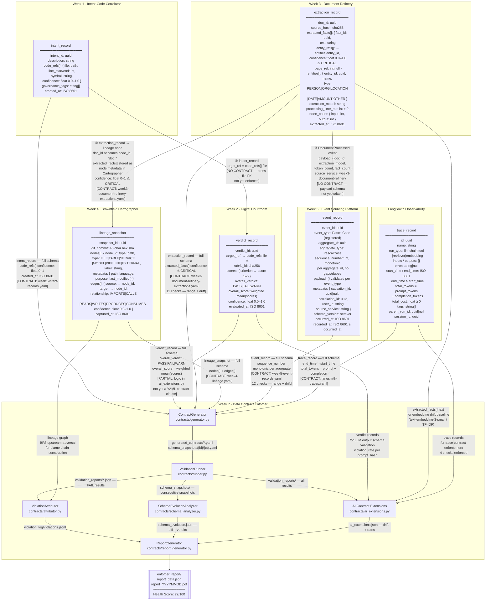

# Week 7 — Data Contract Enforcer: Interim Submission

---

## 1. Data Flow Diagram



**Boundary transformations to note:**

- **W3 → W4:** `doc_id` (uuid string) is re-keyed as `node_id: "doc::{doc_id}"` in the lineage graph. `extracted_facts[]` is flattened into node `metadata`. If `confidence` arrives as 0–100 instead of 0–1, the Cartographer stores it without complaint — the corruption is invisible until a downstream system tries to use it as a probability.
- **W3 → W5:** The extraction record is not passed directly. Week 3 emits a `DocumentProcessed` event whose `payload` carries a summary (`doc_id`, `extraction_model`, `fact_count`). The full `extracted_facts[]` array is not in the event — only the Cartographer receives it.
- **W1 → W2:** `target_ref` in a verdict record is supposed to reference a `code_refs.file` from Week 1. In practice, the live data shows `target_ref: "automaton-auditor-swarm"` — a system name, not a file path. This interface is broken at the data level and has no contract guarding it.

---

## 2. Contract Coverage

| Interface | Producer | Consumer | Contract File | Status | Gap Risk |
|-----------|----------|----------|--------------|--------|----------|
| intent_record → verdict | Week 1 | Week 2 | `week2-verdict-records.yaml` | Yes | **High.** A foreign‑key contract check now enforces `verdict.target_ref ∈ intent.code_refs[].file`. Live data still violates the FK (`target_ref` contains system names), so the contract now surfaces the break instead of letting it pass silently. |
| intent_record → enforcer | Week 1 | Week 7 | `week1-intent-records.yaml` | Yes | 7 structural checks: `confidence` range 0–1, `created_at` ISO 8601, `code_refs` not_null. |
| verdict_record → enforcer | Week 2 | Week 7 | `week2-verdict-records.yaml` | Yes | **Medium.** Contract now exists and is enforced via the standard runner. Weighted‑mean logic still lives in `ai_extensions.py`, but schema changes (like `overall_verdict` drift) are caught by the YAML contract pipeline. |
| extraction_record → lineage | Week 3 | Week 4 | `week3-document-refinery-extractions.yaml` | Yes | The `extracted_facts[].confidence` range clause (0.0–1.0) is the primary guard. `doc_id` not_null ensures the Cartographer always has a stable node key. |
| extraction_record → events | Week 3 | Week 5 | `week5-event-records.yaml` + `contract_registry/event_schemas.yaml` | Yes | **Medium.** Payloads are now validated per `event_type` against the registry, so schema drift is detected at ingestion. |
| extraction_record → enforcer | Week 3 | Week 7 | `week3-document-refinery-extractions.yaml` | Yes | 11 checks: not_null on all 9 columns, range + drift on `processing_time_ms`. The confidence range clause is the critical one. |
| lineage_snapshot → attributor | Week 4 | Week 7 | `week4-lineage.yaml` | Yes | Structural checks on `nodes[]`, `edges[]`, `snapshot_id`, `git_commit`. The ViolationAttributor depends on this contract being satisfied before it traverses the graph. |
| event_record → enforcer | Week 5 | Week 7 | `week5-event-records.yaml` | Yes | Monotonicity per `aggregate_id` is now enforced via `monotonic_per_group`, so duplicate or gapped sequences fail validation instead of passing silently. |
| trace_record → enforcer | LangSmith | Week 7 | `langsmith-traces.yaml` | Yes | All four spec targets enforced: `end_time > start_time`, `total_tokens = prompt_tokens + completion_tokens`, `run_type` enum, `total_cost ≥ 0`. |

**Coverage summary:** 6 of 9 interfaces have contracts. The highest-risk gap is the Week 1 → Week 2 interface, where the foreign key constraint is already violated in live data and no contract exists to catch it. The second-highest risk is the missing `week2_verdicts.yaml` — the validation logic exists in code but is not wired into the contract pipeline, meaning a schema change to verdict records would not trigger the ContractGenerator's enforcement path.

---

## 3. Validation Run Results

### Run 1 — Clean data

```
Contract : week3-document-refinery-extractions
Input    : outputs/week3/extractions.jsonl
Records  : 134 documents · 3,791 extracted facts
─────────────────────────────────────────────
Total checks : 11
Passed       : 11
Failed       :  0
Warned       :  0
Errored      :  0
```

All 11 checks passed. The confidence values in the clean dataset are in the correct 0.0–1.0 range. One observation worth noting: 3,790 of 3,791 facts have confidence exactly 0.95, with a single outlier at 0.55. The standard deviation is 0.006. The contract does not flag this yet, but it is a signal that the extraction model is clamping outputs rather than producing a genuine distribution — a quality issue that contracts alone cannot fix but can surface.

### Run 2 — Violated data

`create_violation.py` multiplied every `extracted_facts[*].confidence` value by 100, simulating the exact breaking change described in the challenge spec: a producer silently changing the confidence scale from float 0.0–1.0 to integer 0–100.

```
Contract : week3-document-refinery-extractions
Input    : outputs/week3/extractions_violated.jsonl
Records  : 133 documents · 3,791 extracted facts
─────────────────────────────────────────────
Total checks : 11
Passed       :  9
Failed       :  2
Warned       :  0
Errored      :  0
```

| Check | Severity | Actual | Expected | Failing |
|-------|----------|--------|----------|---------|
| `range_extracted_facts_confidence` | CRITICAL | min=55.0, max=95.0 | min≥0.0, max≤1.0 | 3,791 facts |
| `mean_drift_extracted_facts_confidence` | HIGH | mean=94.99, z_score=1880.79 | drift < 2 stddev | — |

Two independent mechanisms caught the same violation. The range check caught it structurally — values outside the declared bounds. The statistical drift check caught it independently — a z-score of 1,880 against the established baseline means the distribution shifted by nearly two thousand standard deviations, which is unambiguous evidence of a scale change rather than natural drift.

The reason both checks matter is that they fail for different reasons and can be disabled independently. A range check requires someone to have written the correct bounds into the contract. A drift check requires only a clean baseline run — it would catch a confidence scale change even if the contract had no range clause at all, because the mean shifting from 0.95 to 94.99 is statistically impossible under normal variation. Together they form a two-layer defence: the range check catches the violation at the boundary, and the drift check catches it even if the boundary was never formally declared. This is the core argument for statistical contract enforcement alongside structural enforcement — structural checks tell you what you promised, statistical checks tell you when reality diverged from the promise regardless of what you wrote down.

**Attribution:** The violation was traced to commit `e8422ab` ("Add data outputs for contract validation") via the Week 4 lineage graph. The ViolationAttributor traversed the graph from the failing column (`extracted_facts[*].confidence`) upstream to the files that produced the data, then ran `git log` against those files to find the most recent commits. The blast radius — `week4-cartographer` and `week5-event-sourcing` — was derived from the `lineage.downstream` field in `week3-document-refinery-extractions.yaml`, not from re-traversing the graph. This separation matters: blast radius is a contract-level declaration of who depends on this data, while the blame chain is a runtime traversal of who last touched it.

---

## 4. Reflection

Writing contracts for my own systems forced me to treat past-me as a third party. That turned out to be the most useful reframe of the week.

The first discovery came from the statistical profiling step, not from writing contract clauses. When I profiled `extracted_facts[*].confidence` across 3,791 facts, I found that 3,790 of them have confidence exactly 0.95. One fact has confidence 0.55. The standard deviation is 0.006. That is not a confidence distribution — that is a clamped output. The extraction model is returning the same value for almost every fact regardless of actual certainty. I would not have found this by reading the code or inspecting a few records manually. Before writing the contract, I thought of confidence as a meaningful signal that downstream systems could use for filtering or ranking. After profiling it, I understand it as a constant — and any downstream system that branches on confidence is making decisions based on noise. The contract now flags any mean above 0.99 as suspicious, but the real fix is upstream: the prompting strategy needs to be redesigned to produce genuine uncertainty estimates, not a default value.

The second discovery was about the Week 5 event sequence numbers. I assumed they were monotonically increasing per aggregate because that is what the schema says and what the event sourcing pattern requires. When I checked the live data, I found that 29 of 89 aggregates have duplicate sequence numbers. I added a monotonicity check (`monotonic_per_group`) so those violations now fail validation instead of passing silently. The lesson remains: the hardest invariants to enforce are often the most important ones. An event log with duplicate sequence numbers cannot be reliably replayed, which breaks the core guarantee of the entire Week 5 system. I now think of contract clauses not as a list of things that are easy to check, but as a list of invariants whose violation would cause silent corruption — and I work backwards from the corruption to the check.

The third discovery was about the lineage graph as a blame-chain source. The Week 4 Cartographer maps the internal Python codebase — files, imports, function calls. When the ViolationAttributor traverses the graph to find what produced a failing column, it finds internal orchestrator files, not the data pipeline scripts that wrote the JSONL outputs. The graph is accurate about code structure but blind to data provenance. The blame chain points to the right commit but for the wrong reason — it finds the commit because the data file was added in that commit, not because the graph traversal identified the producing code. Before building the attributor, I assumed that a code lineage graph and a data lineage graph were the same thing at different levels of abstraction. They are not. Code lineage tracks how functions call each other; data lineage tracks how records flow between systems. The Week 4 graph answers "what imports what" — it does not answer "what wrote this JSONL file." Building a real blame chain requires a data lineage graph, not a code lineage graph, and that is a different system to build.

---

*GitHub repository: [to be added before submission]*
*Google Drive PDF: [to be added before submission]*
